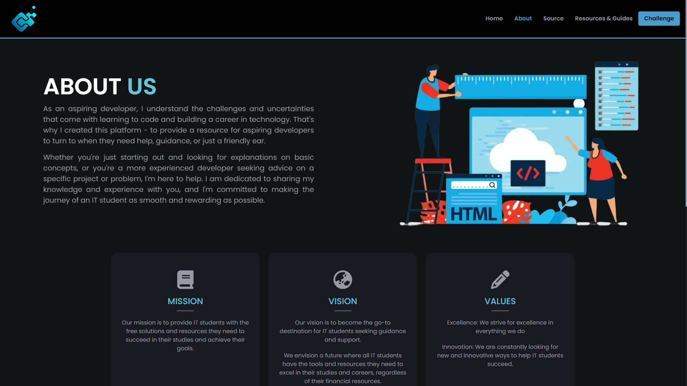

  

  <h3 align="center">Acessignment</h3>

  

    A Website to start your coding journey 
     
    <a href="https://acessignment.vercel.app/"><strong>View Demo »</strong></a>
     
    <a href="https://github.com/lugh-tuatha/acessignment/issues">Report Bug</a>
    ·
    <a href="https://github.com/lugh-tuatha/acessignment/issues">Request Feature</a>
  

## About the project
> Discover a wealth of free resources and guides to help you on your IT and development journey. Whether you're an aspiring developer or a seasoned pro, this website has something for everyone. From tutorials and code snippets to useful websites and free online courses, we've got you covered.

Get the help you need on your coding assignments with our website. Making it easy for you to find solutions for your assignments. Search through this website of answers or submit a question of your own, and start coding with confidence.

## built with 
Here, you will find information about the languages, frameworks, and libraries that were used to create this project.
   

## Roadmap

- [ ] Fix Sass files make it more readable & Maintainable 
- [ ] Add More challenges
    - [ ] Responsive
    - [ ] JS Counter
- [ ] Add More resources 
    - [ ] Interview Preparation
    - [ ] Comprehensive Library
    - [ ] Useful Chrome Extension

## Contributing
Contributions are what make the open source community such an amazing place to learn, inspire, and create. Any contributions you make are **greatly appreciated**.

If you have a suggestion that would make this better, please fork the repo and create a pull request. You can also simply open an issue with the tag "enhancement".
Don't forget to give the project a star! Thanks again!

1. Fork the Project
2. Clone `git clone https://github.com/lugh-tuatha/acessignment.git`
3. Create your Feature Branch `git checkout -b <branch_name>`
4. Commit your Changes `git commit -m 'Add some AmazingFeature'`
5. Push to the Branch `git push origin <branch_name>`
6. Open a Pull Request

## Acknowledgments
I want to acknowledge the valuable contributions of these resources in the development of our project.
* [AOS - Animate on Scroll](https://github.com/michalsnik/aos/tree/v2)
* [Form-to-google-sheets](https://github.com/jamiewilson/form-to-google-sheets)
* [Code Image](https://app.codeimage.dev/)
* [Scribehow](https://scribehow.com/)
* [Font Awesome](https://fontawesome.com)
* [Sweet Alert](https://sweetalert2.github.io/)

