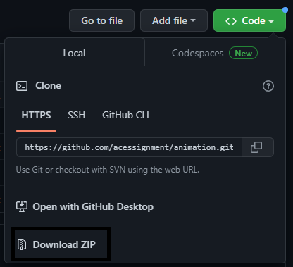
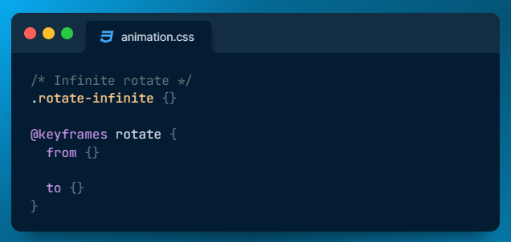

# CSS - Animation starter pack

## How to participate

1. To start this challenge first download this starterpack repository  

2. Open the project to your VScode

3. From there you can now fill the unfilled property at "your.css" file

4. Submit your code [here](https://acessignment.vercel.app/try-challenge.html)
- NOTE: Dont add/remove any line of code in scss folder

